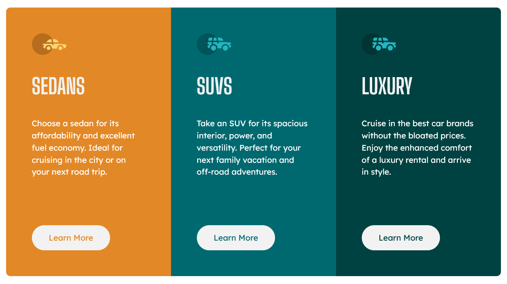

# 3-column preview card component - Frontend Mentor

This is a solution to the [3-column preview card component on Frontend Mentor](https://www.frontendmentor.io/challenges/3column-preview-card-component-pH92eAR2-).

[Frontend Mentor](https://www.frontendmentor.io) challenges help you improve your coding skills by building realistic projects.

## Table of contents

- [Overview](#overview)
  - [The challenge](#the-challenge)
  - [Screenshot](#screenshot)
  - [Links](#links)
- [My Process](#my-process)
  - [Built with](#built-with)
- [Author](#author)

## Overview

### The challenge

Your challenge is to build out this 3-column preview card component and get it looking as close to the design as possible.

You can use any tools you like to help you complete the challenge. So if you've got something you'd like to practice, feel free to give it a go.

Your users should be able to:

- View the optimal layout depending on their device's screen size
- See hover states for interactive elements

### Screenshot

### Links

- [solution URL](https://www.frontendmentor.io/challenges/3column-preview-card-component-pH92eAR2-/hub/responsive-3column-card-component-using-flexbox-Bh2SVpVVW0)
- [live site URL](https://mattpahuta.github.io/3-column-component/)

## My process

Rather than build this layout with CSS Grid, which would have been the most straightforward approach, I decided to use the project to practice Flexbox properties.

### Built with

- Semantic HTML5 markup
- CSS custom properties
- Flexbox
- Mobile-first workflow

## Author

- Frontend Mentor - [@MattPahuta](https://www.frontendmentor.io/profile/MattPahuta)
- Twitter - [@MattPahuta](https://twitter.com/MattPahuta)